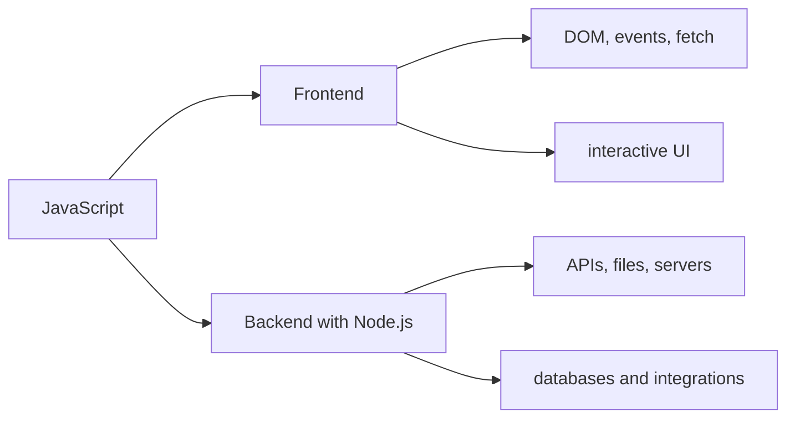

# Introduction

## 1. What it is

JavaScript is a high-level, dynamically typed language used to build interactive web apps and server-side applications.

## 2. What it is used for

- browser interactivity
- frontend logic
- backend APIs with Node.js
- scripts, tooling, and automation
- interview and coding assessment problems

## 3. Runtime environments

| Environment | What it runs | Typical APIs | Interview note |
| --- | --- | --- | --- |
| Browser | user-facing web apps | DOM, events, `fetch`, storage | know the DOM and event loop |
| Node.js | server-side and tooling | `fs`, `path`, timers, HTTP | know modules and async I/O |

## 4. ECMAScript

- ECMAScript is the language specification.
- JavaScript is the implementation you use in browsers and Node.js.
- ES6+ usually means modern JavaScript features like `let`, `const`, classes, modules, and arrow functions.

## 5. Compilation vs interpretation

| Concept | Short explanation | Interview note |
| --- | --- | --- |
| Compilation | code is translated before execution | modern engines often optimize ahead of time |
| Interpretation | code is executed step by step | JavaScript is often described this way in interviews |
| Just-in-time (JIT) | runtime compilation and optimization | mention this if asked about performance |

## 6. Execution model

1. Parse source code.
2. Create execution context.
3. Allocate memory for variables and functions.
4. Execute line by line.
5. Use the event loop for async work.

## 7. Common use cases

| Use case | Example |
| --- | --- |
| UI interactions | buttons, forms, modal windows |
| API calls | loading data with `fetch` |
| State updates | counters, filters, dashboards |
| Backend services | REST APIs, auth, file handling |
| Automation | scripts, CLI tools, build tasks |

## 8. Roadmap

## 9. Common mistakes

- treating JavaScript like Java
- confusing runtime APIs with the language itself
- assuming `==` is safe
- ignoring async behavior

## 10. Interview notes

- explain the difference between browser and Node.js runtimes
- know what ECMAScript means
- be ready to describe the event loop at a high level
- mention that JavaScript is single-threaded but async

## 11. Exercises

### Beginner exercises

- name three things JavaScript is used for
- explain the difference between browser and Node.js

### Intermediate exercises

- describe ECMAScript in one sentence
- explain why JavaScript can still handle async tasks

### Advanced exercises

- draw the execution model from parsing to async work
- compare compilation, interpretation, and JIT

### Recommended LeetCode problems

- Two Sum
- Valid Parentheses

### Recommended HackerRank problems

- JavaScript basics warm-up
- string and array manipulation
