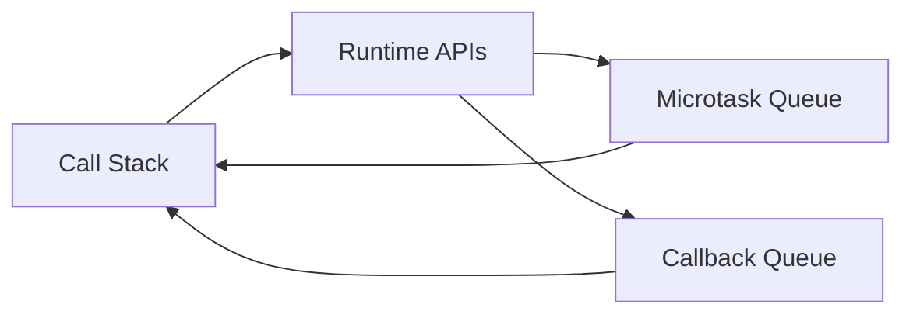

# Asynchronous JavaScript

## 1. What it is

Asynchronous JavaScript lets code start work now and finish later without blocking the main thread.

## 2. What it is used for

- API calls
- timers and UI delays
- file and network work in Node.js
- background tasks in browser apps

## 3. Core runtime pieces

| Piece | What it does | Interview note |
| --- | --- | --- |
| Call stack | runs synchronous code | top-of-stack code executes first |
| Web APIs / runtime APIs | handle timers, network, DOM events | browser or Node.js provides these |
| Callback queue | stores ready callbacks | often called the task queue |
| Microtask queue | stores promise callbacks | runs before the callback queue |
| Event loop | moves ready work back to the stack | core interview topic |

## 4. Event loop diagram



## 5. Promises and async/await

| Concept | What it means | Example | Common mistake |
| --- | --- | --- | --- |
| Promise | value that may be available later | `fetch(url).then(...)` | forgetting to handle rejection |
| `async` | function returns a promise | `async function load() {}` | expecting synchronous results |
| `await` | pauses inside an async function | `const data = await fetch(...)` | using it outside `async` |
| `try/catch` | handles thrown errors from awaited code | `try { await load(); } catch {}` | only wrapping the promise creation |

## 6. Example

```javascript
async function loadUser() {
  try {
    const response = await fetch("/api/user");
    const data = await response.json();
    return data;
  } catch (error) {
    console.error(error);
    return null;
  }
}
```

## 7. Common mistakes

- assuming async code blocks the main thread
- forgetting that promise callbacks run as microtasks
- mixing `.then()` chains and `await` without a reason
- forgetting `try/catch` around awaited calls

## 8. Interview notes

- explain the call stack, queues, and event loop in order
- know the difference between microtasks and callback queue tasks
- know when to use promises vs `async/await`
- mention that JavaScript is single-threaded but async

## 9. Exercises

### Beginner exercises

- explain what a Promise is
- write a small `async` function
- use `fetch` and log JSON data

### Intermediate exercises

- describe what the event loop does
- compare `.then()` with `await`
- catch an error from an async function

### Advanced exercises

- explain why promise callbacks run before timers
- sketch the flow from stack to queue to stack
- debug an async function that forgets `await`

### Recommended LeetCode problems

- Promise-style control flow warm-ups
- asynchronous state simulation tasks

### Recommended HackerRank problems

- timers and asynchronous flow exercises
- API-style practice problems
